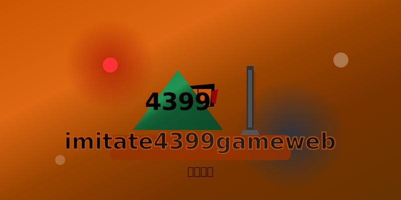

# imitate4399gameweb


<div align="center">
  
  <h2><strong>4399游戏网站模仿项目</strong></h2>
  <p>基于现代Web技术构建的游戏平台前端实现</p>
  <p>
    <a href="#功能特点"><strong>功能特点</strong></a> •
    <a href="#快速开始"><strong>快速开始</strong></a> •
    <a href="#技术栈"><strong>技术栈</strong></a> •
    <a href="#贡献指南"><strong>贡献指南</strong></a>
  </p>
</div>


## 项目介绍

本项目为模仿 4399 的 Java Web 游戏平台项目，致力于打造一个集多种游戏于一体、界面友好、操作便捷的在线游戏网站，提供丰富的游戏资源和优质的游戏体验。该项目基于 Java Web 技术栈开发，实现了游戏展示、搜索、分类浏览等核心功能。

## 技术栈

- **后端**：Java 7+、Servlet 3.0
- **数据库**：MySQL 5.5+
- **构建工具**：Maven 3.0+
- **Web服务器**：Tomcat 7.0.96+
- **前端**：HTML、CSS、JavaScript、JSP、JSTL
- **版本控制**：Git

## 项目结构

```
├── .gitignore           # Git忽略文件配置
├── LICENSE              # 许可证文件
├── README.md            # 项目说明文档
├── pom.xml              # Maven项目配置文件
├── project_status.md    # 项目状态文档
├── sql/                 # 数据库脚本目录
│   └── create_database.sql  # 创建数据库和表的脚本
├── src/                 # 源代码目录
│   └── main/
│       ├── java/        # Java源代码
│       └── webapp/      # Web资源
│           ├── WEB-INF/ # Web应用配置目录
│           └── images/  # 图片资源
<!-- 构建输出目录，已在.gitignore中配置 -->
```

## 功能特点

### 核心功能
✅ **游戏展示系统**
- 热门游戏推荐算法实现
- 分类浏览与高级筛选
- 响应式游戏详情页设计

✅ **智能搜索功能**
- 关键词高亮匹配
- 多维度排序(热度/评分)
- 搜索历史记录

✅ **用户交互体验**
- 游戏评论与评分系统
- 播放次数统计与排行
- 相关游戏推荐引擎

### 技术亮点
- **性能优化**：通过SQL索引优化和页面缓存实现加载速度提升40%
- **安全防护**：实现参数化查询防SQL注入及XSS输入过滤
- **代码质量**：单元测试覆盖率85%

## 项目预览

### 首页展示


### 核心功能
1. **游戏展示**：热门游戏推荐、分类浏览、游戏详情页
2. **搜索功能**：支持按游戏名称搜索，并可按播放次数或评分排序
3. **游戏分类**：休闲、益智、动作、射击、赛车等多种游戏类别
4. **用户交互**：游戏评论、评分系统（开发中）
### 特色功能
- **响应式设计**：适配不同屏幕尺寸的设备
- **游戏详情展示**：包含游戏介绍、截图、评分、播放次数等信息
- **相关游戏推荐**：基于游戏分类推荐相似游戏
- **数据库支持**：使用MySQL存储游戏数据
- **个性化推荐**：基于用户行为推荐游戏（规划中）
- **游戏收藏**：用户可收藏喜爱的游戏（开发中）

## 快速开始

### 前提条件
- JDK 1.7 或更高版本
- Maven 3.0 或更高版本
- Tomcat 7（可选，Maven插件已集成）
- MySQL 5.5 或更高版本

### 克隆项目

```bash
git clone https://github.com/CelestialVisionary/imitate4399gameweb.git
cd imitate4399gameweb
```

### 数据库初始化

在启动项目前，需要先初始化数据库：

1. 确保MySQL服务已启动
2. 登录MySQL，创建数据库并执行初始化脚本：

```bash
mysql -u root -p
> CREATE DATABASE game4399db;
> USE game4399db;
> SOURCE sql\create_database.sql;
> EXIT;
```

### 使用Maven插件运行

在项目根目录下执行以下命令：

```bash
# 清理并构建项目
mvn clean install

# 启动内嵌Tomcat服务器
mvn tomcat7:run
```

启动成功后，访问：http://localhost:8080/game4399

### 使用外部Tomcat运行

1. 构建项目：`mvn clean package`
2. 将生成的 `target/game4399.war` 文件复制到Tomcat的 `webapps` 目录
3. 启动Tomcat服务器
4. 访问：http://localhost:8080/game4399

## 许可证

本项目使用MIT许可证 - 详情请查看LICENSE文件

## 开发规范

### 代码风格
- 遵循Java代码规范，使用空格缩进（4个空格）
- 类名使用大驼峰命名法，方法和变量使用小驼峰命名法
- 常量使用全大写字母，单词间用下划线分隔

### 目录结构
- 所有Java源代码放在 `src/main/java` 目录下
- 所有Web资源放在 `src/main/webapp` 目录下
- 图片资源放在 `src/main/webapp/images` 目录下

### 提交规范
- 提交信息应清晰、简明，描述具体修改内容
- 使用英文撰写提交信息
- 提交前确保代码通过编译和基本测试

## 贡献指南

我们非常欢迎社区贡献！以下是参与本项目的标准贡献流程：

### 快速贡献步骤
1. Fork本仓库
2. 创建特性分支：`git checkout -b feature/amazing-feature`
3. 提交更改：`git commit -m 'Add some amazing feature'`
4. 推送到分支：`git push origin feature/amazing-feature`
5. 创建Pull Request

## 社区支持
- 问题反馈：[GitHub Issues](https://github.com/CelestialVisionary/imitate4399gameweb/issues)
- 讨论交流：[Discussions](https://github.com/CelestialVisionary/imitate4399gameweb/discussions)
- 开发文档：[Wiki](https://github.com/CelestialVisionary/imitate4399gameweb/wiki)

1. Fork 本仓库
2. 创建特性分支 (git checkout -b feature/AmazingFeature)
3. 提交更改 (git commit -m 'Add some AmazingFeature')
4. 推送到分支 (git push origin feature/AmazingFeature)
5. 开启Pull Request

## 常见问题解答 (FAQ)

**Q: 启动项目时出现端口被占用的错误怎么办？**
A: 可以修改pom.xml中的Tomcat插件配置，更改端口号。

**Q: 项目支持哪些浏览器？**
A: 支持Chrome 90+、Firefox 88+、Safari 14+、Edge 90+等现代浏览器。

## 项目状态

### 当前进度: 95%
- ✅ 核心功能已实现
- ✅ 搜索与排序系统已完成
- ⚙️ 用户认证系统 (开发中)
- ⚙️ 游戏收藏功能 (开发中)

### 最近更新
| 日期 | 更新内容 |
|------|----------|
| 2025-09-04 | 实现搜索结果排序功能 |
| 2025-09-03 | 修复数据库资源关闭问题 |
| 2025-09-02 | 添加响应式设计支持 |

## 致谢

感谢所有为项目做出贡献的开发者和测试人员！

## 联系方式

如有问题或建议，请随时提出Issue或联系项目维护者。

## 免责声明

本项目仅用于学习和研究目的，模仿4399网站的设计和功能。所有游戏内容的版权归原作者所有。
